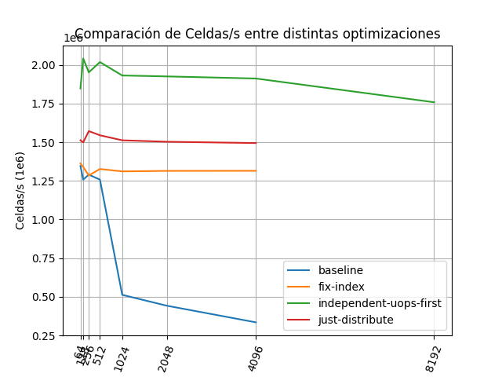

# Haswell Comparando Celdas por segundo entre primeras 3 optimizaciones
En este experimento comparamos la performance de tres optimizaciones para distintos tamaños de N.
Las optimizaciones son:
- Fix Index: cambiar los índices de la macro IX para que sean cache-line friendly, recorra por columnas sin dar saltos en la direccion de memoria.
- Fix Index + Independent Uops First: Esta optimización busca indicarle al compilador que ejecute todas las operaciones que pueden hacerse de manera independiente evitando la dependencia del resultado de la iteración anterior (Loop Carried dependency).
- Fix Index + Just Distribute: Esta es una optimización de control, para entender cuánto ayudamos al compilador con `Independent Uops First` vs solo presentarle las operaciones de manera menos anidada.

Todas las versiones fueron compiladas con las mismas flags: `-O3 -march=native -ffast-math`

## Como correrlo
Primero instalar los requisitos listados en el [README]('../README.md')
```
git clone git@github.com:germanferrero/navier-stokes-experiments.git
cd navier-stokes-experiments/05-fix-index-vs-independent-ops-first-vs-baseline
make
```

## Resultados

<figure>
    
    <figcaption>Fig 4: Cells per second vs N</figcaption>
</figure>

En los resultados podemos ver como la optimización fix-index es importantísima para garantizar un buen acceso a memoria a partir de N >= 1024. Sin esa optimización, nos chocamos fuerte con el Memory Wall.
Luego podemos ver como just-distribute da una ganancia de 1.15x respecto a fix-index para N desde 1024 a 4096 al menos.
Mientras que la optimización de Independent Uops First representa una mejora de ~1.4x respecto a fix-index para N desde 1024 a 4096 al menos.

En siguientes iteraciones buscaremos librarnos definitivamente de la Loop Carried Dependency.

[EDIT 29/06/2021: Efectivamente, como comentaba Charly Bederián, la performance de la versión independent-uops-first se debe a que el compilador autovectoriza esa parte del cálculo :)]