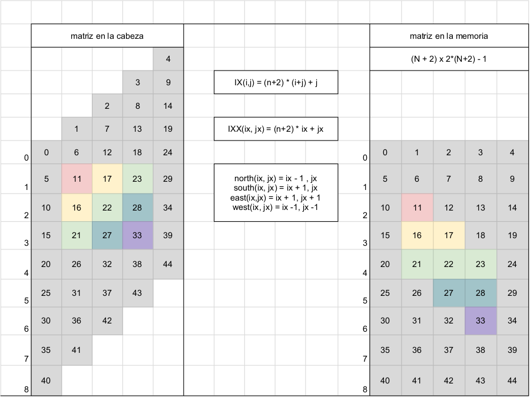
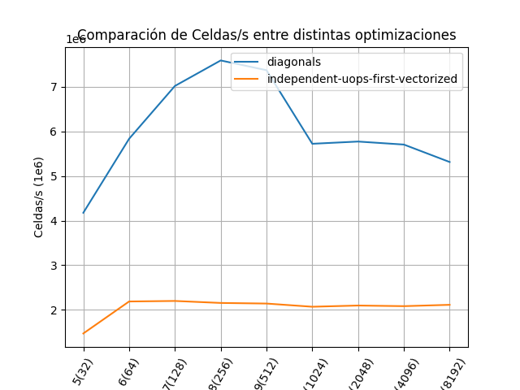

# Vectorización: Recorriendo la matriz por diagonales.
Procesamos las diagonales de la matriz de forma secuencial, y vectorizamos
el procesamiento sobre cada diagonal.
Comparamos esta optimización contra la mejor optimización lograda en el lab1.

## Como correrlo
Primero instalar los requisitos listados en el [README]('../README.md')
```
git clone git@github.com:germanferrero/navier-stokes-experiments.git
cd navier-stokes-experiments/06-independent-ops-first-vs-diagonals
make
```

## Disposición de celdas en memoria
Seguimos la lógica graficada en esta imagen para determinar la dirección de memoria de cada celda:

<figure>
    
    <figcaption>Fig 1: Disposición en Memoria</figcaption>
</figure>

Reordenando las celdas en memoria siguiendo 
```
IX(i,j) = ( N + 2 ) * ( i + j ) + j 
```
Logramos tener las celdas de una misma diagonal continuos en memoria.
Además, podemos indicar para cada celda dónde encontrar las celdas Norte, Sur, Este, Oeste. Y estas celdas asociadas también están contiguas en memoria a medida que avanzamos sobre las celdas procesadas.
(i.e Si la celda norte de la celda `i` está en `k`, la norte de la celda `i+1` están en `k+1`).

Notar que para lograr este ordenamiento en memoria duplicamos la cantidad
de memoria utilizada, con bytes de relleno, que la única función que cumplen es mantener las reglas de posicionamiendo de las celdas asociadas para cada celda a procesar.

Queda como oportunidad de mejora buscar una solución sin la necesidad de bytes de relleno.

## Progreso de la optimización
Lo primero que hicimos fue entonces modificar el loop de `lin_solve` para
que recorra los elementos de la matriz siguiendo las diagonales.
Utilizando `IXX(ix, jx) ((jx) + (n + 2) * (ix))`, podemos recorrer las diagonales secuencialmente moviéndonos en ix, y luego moviéndonos en jx, cada elemento de la diagonal.
Utilizando las flags de compilación `-O1 -march=native -ffast-math -ftree-vectorize` logramos que el compilador autovectorize el loop central de `lin_solve`.

Lo que movió el choque con el Memory Wall a la función `project` que continuaba utilizando instrucciones escalares.
Aplicamos el mismo truco entonces a `project` y el compilador nuevamente autovectorizó los dos loops de `project` antes y después de `lin_solve`.

Luego de esa modificación, el choque con el Memory Wall pasó a estar en la función `advect`. Y repetimos la modificación en esa función para vectorizarla también. En este caso, la función `advect` tiene un acceso a memoria dictado por los datos de la celda, rompiendo con el comportamiento de acceso continuo de las otras dos funciones.
El acceso a memoria discontinua está dado por este cálculo de índices:
```
x = i - dt0 * u[IX(i, j)];
y = j - dt0 * v[IX(i, j)];
```
Para poder recorrer la matriz por diagonales y aún así obtener `x` e `y` utilizamos el siguiente resultado de nuestro ordenamiento en memoria:
```
i == ix - jx;
j == jx;
```
Es decir, el índice de la diagonal actual menos el offset sobre la diagonal nos da el índice de la fila de la celda. Y el offset sobre la diagonal es igual al índice de la columna de la celda.
Gracias a ese resultado, pudimos recorrer la matriz por diagonales en `advect`, accediendo las celdas de forma contigua, y vectorizando, a pesar de que las celdas asociadas necesarias para actualizar el valor de cada celda a procesar tienen accesos a memoria discontinuos.

Luego de esta última modificación, el mayor tiempo de ejecución volvió a estar sobre el loop de `lin_solve`, pero ya sobre sus operaciones vectoriales.


## Resultados

<figure>
    
    <figcaption>Fig 4: Cells per second vs N</figcaption>
</figure>

En los resultados podemos ver que la versión que vectoriza el cálculo
de lin_solve para cada diagonal es 2.7x veces más rápida que la mejor versión obtenida en el lab1, que solo vectorizaba una cantidad menor de operaciones.