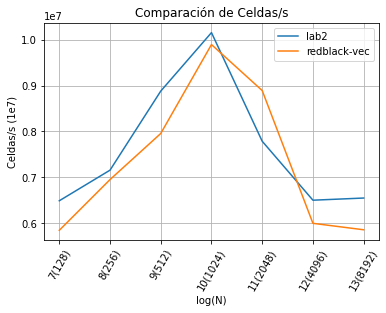
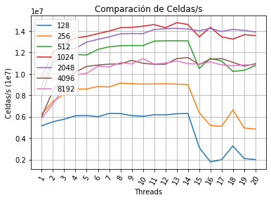
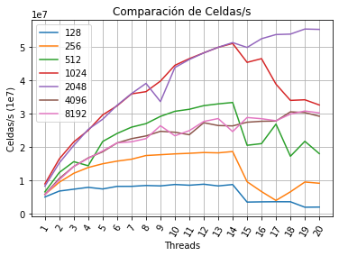
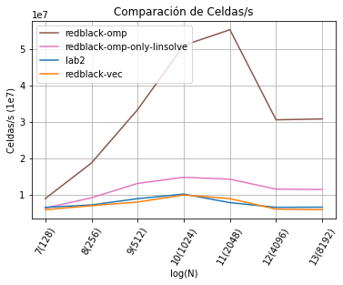

# RedBlack con OpenMP
En este experimento introducimos el linear solver RedBlack Gauss Seidel.
El primer paso fue lograr una implementación vectorial de RB que performe igual o mejor que la mejor versión vectorial obtenida en el lab2.

La estrategia elegida fue buscar que el compilador autovectorice el código.

Algunos cambios necesarios para lograrlo, sobre el código base que nos presentó Charly, fueron:
- Cambiar ix() por una Macro
    ```c
     #define IXX(y, x, stride) ((x) + (y) * (stride))
    ```
    Ya que el compilador se quejaba de que no podía vectorizar con la llamada a función.
- Reutilizamos el recorrido de los elementos de la matriz congruente con la disposición de los mismos en memoria para las funciones project y para advect.
    - Los trucos de indexado en project:
    ```c    
    project_before_rb_step(...){
        (...)
        // Restar el de la izquierda y sumar el de la derecha con el shift
        v[index] -= 0.5f * n * ((p_shift * p[index + p_shift]) +(-p_shift * p [index]));
        (...)
     }
 
    project_after_rb_step(...)
    ```
    - Los trucos de indexado en advect:
    ```
    advect_rb_step(...){
        (...)
        // Calculo de i y j original
        int i = yit;
        int j = 1 - start  + 2 * xit;
        int index = IXX(yit, xit, width);
        (...)
    }
    ```

Con estas modificaciones el compilador fue capaz de autovectorizar las funciones:
    - lin_solve_rb_step
    - project_before_rb_step
    - project_after_rb_step
    - advect_rb_step
Que concentraban el cómputo pesado.
La performance obtenida para esta versión fue similar a la de la mejor versión obtenida para el lab2 como se muestra en la siguiente gráfica:

<figure>
    
    <figcaption>Fig 1: Comparación soluciones vectoriales</figcaption>
</figure>

De aquí en adelante avanzamos con la versión RedBlack con el objetivo de paralelizar el cómputo en N cores con OpenMP.

La primera estrategia para paralelizar el cómputo fue paralelizar el cómputo de las filas de la matriz utilizando pragmas de omp en `lin_solve_rb_step`.

Agregamos pragma omp parallel for y movimos la definición de shift y start adentro del loop.

```
#pragma omp parallel for default(none) shared(same, same0, neigh) \
     firstprivate(n, shift, start, width, a, c)
     for (unsigned int y = 1; y <= n; ++y) {
         const int p_shift = y % 2 == 0 ? -shift: shift;
         const int p_start = y % 2 == 0 ? 1 - start: start;
         (...)
```

Con esta sola modificación la performance para N = 4096 y 8192 escalaba como máximo para cualquier cantidad de threads >=6 a 11e6 celdas por segundo, un speedup de 2x respecto a la versión vectorial.
Cómo se puede visualizar en la siguiente figura:

<figure>
    
    <figcaption>Fig 2: Scaling para n threads solo linsolve </figcaption>
</figure>

En esta figura además, se puede ver como la paralelización en N cores no paga para los tamaños de problema más chicos (128 y 256). Para N más grandes escala. Y cuando N es 4096 o mayo, el problema se cae de la caché y la performance deja de crecer con el N.

Además se ve como al cruzar la cantidad de threads de un único NUMA node, la performance decrece repentimamente por la paginación de memoria, siendo más notorio para N más chicos la caída que para N más grandes.

Lo siguiente que probamos fue paralelizar el cómputo de las filas también en project y en advect, con lo cual obtuvimos los siguientes resultados de speedup y eficiencia:

- N = 2048
    - Threads = 8: Speedup 4.4, Eficiencia 55%
    - Threads = 14: Speedup 5.7, Eficiencia 40%
    - Threads = 20: Speedup 6.2, Eficiencia 31%

- N = 8192
    - Threads = 8: Speedup 3.8, Eficiencia 48%
    - Threads = 14: Speedup 4.9, Eficiencia 35%
    - Threads = 20: Speedup 5.1, Eficiencia 26%

Extraídos de la gráfica de scaling para esta versión:

<figure>
    
    <figcaption>Fig 3: Scaling para n threads + project y advect </figcaption>
</figure>


Finalmente en la siguiente gráfica se puede ver la comparación en celdas por segundo para las dos versiones vectoriales, paralelizar solo linsolve con omp y paralelizar tanto linsolve como project y advect.
En el eje de las x está el tamaño del problema y en el eje de las y está el resultado en celdas por segundo de la mejor configuración en número de threads para cada versión según el tamaño del problema.

<figure>
    
    <figcaption>Fig 4: Mejor performance por cada N </figcaption>
</figure>

