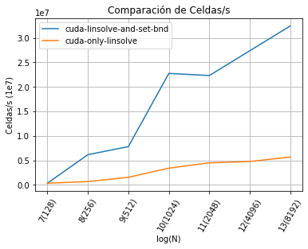
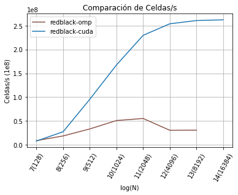
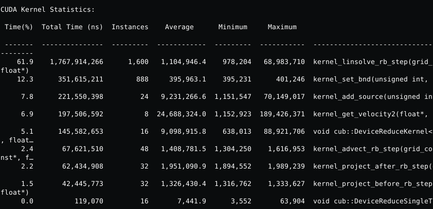
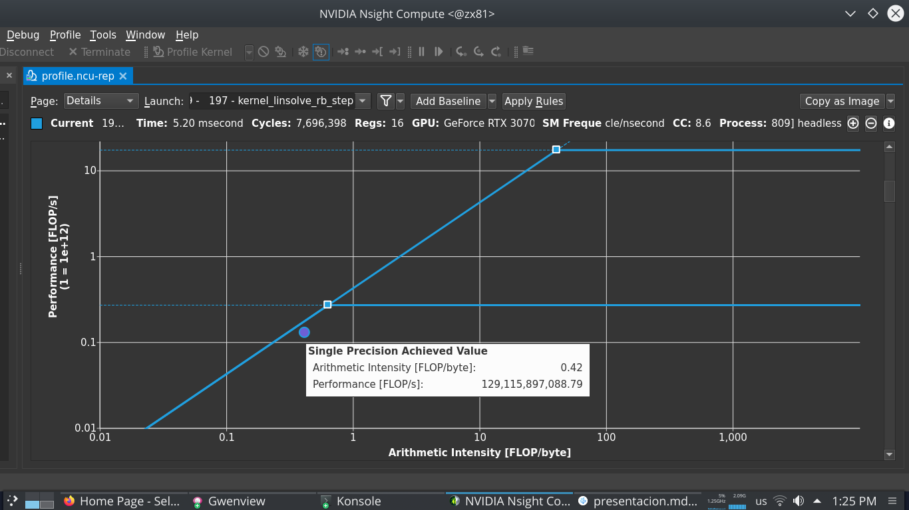

# Lab4: RedBlack en Cuda.

El primer esfuerzo para este laboratorio fur resolver la compilación. Primero intenté mantener archivos .c y .cu al mismo tiempo y compilarlos con clang / nvcc linkearlos con nvcc, y se me complicó bastatnte. Luego lo pasé todo a .cu y salió derecho.

Luego la estrategia para pasar el código a GPU fue migrar desde la función más pesada en cómputo total a la más liviana, hasta migrar todo el cómputo a la GPU, para evitar la paginación de memoria del host al device.

El primer kernel implementado fue el de linsolve, que lancé con bloques bidimensionales de 16 por 16.

```
__global__ void kernel_linsolve_rb_step(
    grid_color color,
    unsigned int n,
    float a,
    float c,
    const float * same0,
    const float * neigh,
    float * same)
{
    unsigned int width = (n + 2) / 2;
    int x = blockIdx.x * blockDim.x + threadIdx.x;
    int y = blockIdx.y * blockDim.y + threadIdx.y;
    int index = IXX(y, x, width);
    int start_first_row = color == RED ? 0 : 1;
    int start = y % 2 == 1 ? start_first_row : 1 - start_first_row;
    if (x < start) {
        return;
    }
    if (x >= width + start - 1) {
        return;
    }
    if (y == 0 || y >= n+1) {
        return;
    }
    
    int shift_first_row = color == RED ? 1 : -1;
    int shift = y % 2 == 1 ? shift_first_row: -shift_first_row;
    same[index] = (same0[index] + a * (
        neigh[index - width] +
        neigh[index] +
        neigh[index + shift] +
        neigh[index + width]
    )) / c;
}
```

Luego implemnté el siguiente kernel de set boundaries que aunque es muy ineficiente en el uso de la memoria permi
---

```c
__global__ void kernel_set_bnd(unsigned int n, boundary b, float* m)
{
    int x = blockIdx.x * blockDim.x + threadIdx.x;
    int y = blockIdx.y * blockDim.y + threadIdx.y;

    if (x > (n + 1) || y > (n + 1)){
        return;
    }
    int index = IX(x, y);
    if (x == 0){
        if (y == 0){
            m[index] = 0.5f * (m[IX(1, 0)] + m[IX(0, 1)]);
        }
        if (y == n+1){
            m[index] = 0.5f * (m[IX(1, n + 1)] + m[IX(0, n)]);
        }
        else {
            m[index] = b == VERTICAL ? -m[IX(1, y)] : m[IX(1, y)];
        }
    }
    (...)
}
```

Permite visualizar como impacta en la performance evitar el ida y vuelta de memoria entre el host y la GPU, como se puede visualizar aquí:

<figure>
    
    <figcaption>Fig 1: linsolve vs linsolve + set_bnd</figcaption>
</figure>

A continuación implementé kernels muy similares al de linsolve para el resto del cómputo de project y advect.

En la función react hay una reducción que es calcular el máximo de una matriz, para lo cuál utilicé la lib cub.

```
__global__ void kernel_get_velocity2(float * velocity2, unsigned int n, const float* u, const float* v) {
    unsigned int width = (n + 2) / 2;
    int x = blockIdx.x * blockDim.x + threadIdx.x;
    int y = blockIdx.y * blockDim.y + threadIdx.y;
    if (x > (n + 1) || y > (n + 1)){
        return;
    }
    int index = IXX(y, x, width);
    velocity2[index] = u[index] * u[index] + v[index] * v[index];
}

void react(...){
    (...)
    launcher_get_velocity2(velocity2, N, u, v);
    void *v2_temp_storage = NULL;
    size_t v2_temp_storage_bytes = 0;
    cub::DeviceReduce::Max(v2_temp_storage, v2_temp_storage_bytes, velocity2, max_velocity2, size);
    checkCudaCall(cudaMalloc(&v2_temp_storage, v2_temp_storage_bytes));
    cub::DeviceReduce::Max(v2_temp_storage, v2_temp_storage_bytes, velocity2, max_velocity2, size);
    (...)
}
```

Probé para distintos tamaños de bloque y obtuve estos resultados para N = 8192:
    - BS = 32, Cps: 217 1e6
    - BS = 16, Cps: 260 1e6
    - BS = 8, Cps: 201 1e6

Con la versión final, obtuve un speedup de 10x respecto a la versión de omp para N=4096 y N=8192 y pude correrlo para N=16384, más allá de eso no entraba en la memoria de la GPU.

<figure>
    
    <figcaption>Fig 2: omp vs cuda </figcaption>
</figure>


Obtuve estos tiempos de ejecución para los kernels. Donde me llamó la atención el tiempo que tarda un kernel simple como velocities2, la hipótesis es que al correr esporádicamente nunca llega a calentar la caché en comparación con linsolve por ejemplo.

<figure>
    
    <figcaption>Fig 3: Estadísticas de kernels</figcaption>
</figure>


Y en el roofline, obtuve 129GFLOPs 

<figure>
    
    <figcaption>Fig 4: Roofline Linsolve</figcaption>
</figure>

Para mejorar me quedó en el tintero:
- Usar múltiples CUDA streams para paralelizar kernels cuando sea posible.
- Explorar las ayudas de ncu-ui en detalle, que me sorprendió la cantidad de herramientas gráficas y métricas que tiene.
