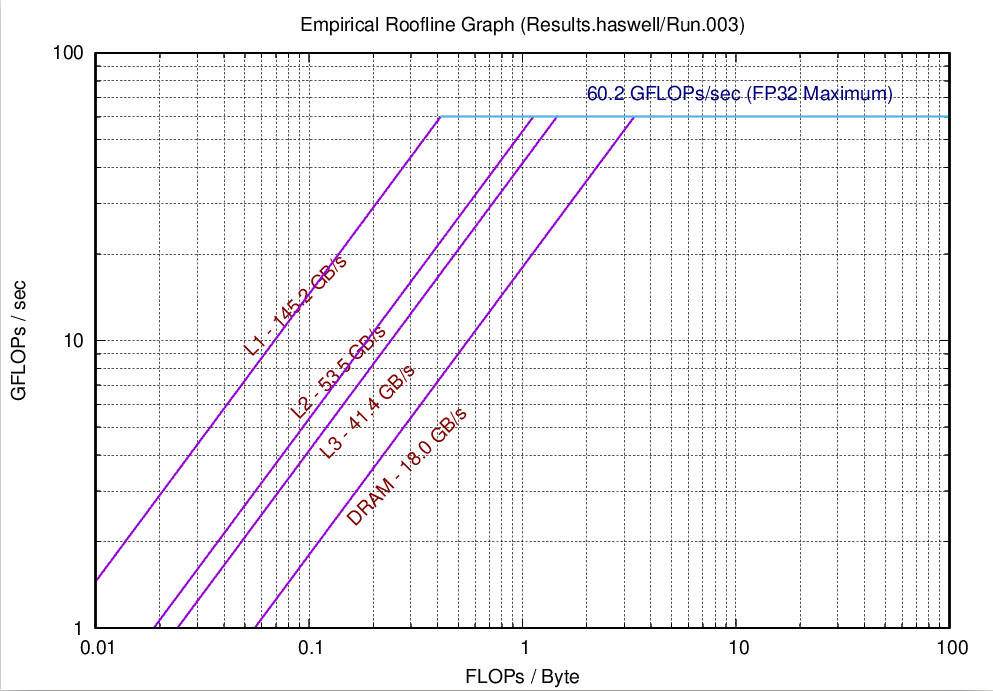
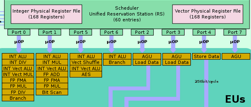
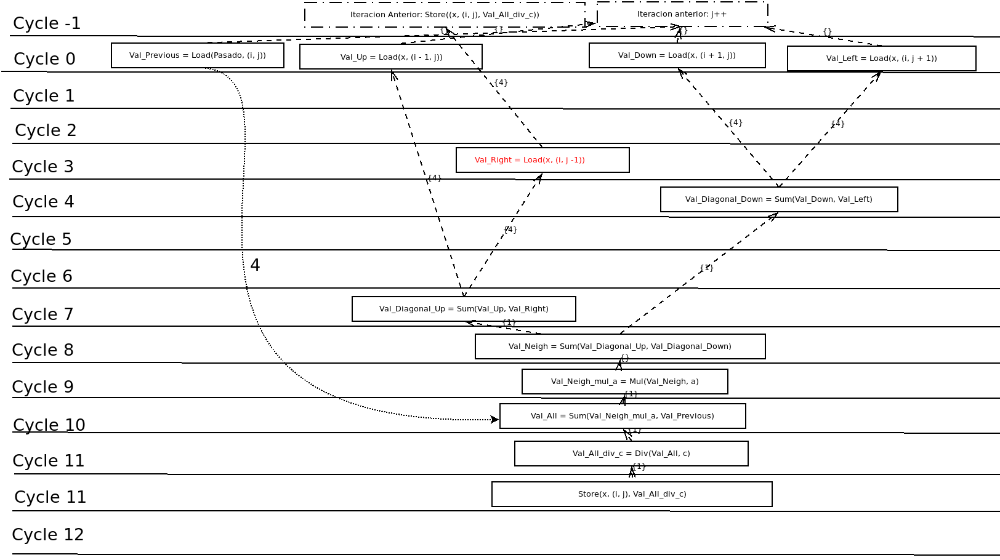

# Navier Stokes - Lab1

- Grupo:
    - Margionet Fabiola (Física)
    - Germán Ferrero (Computólogo)

---

# Agenda
1.  Caracterízticas de Hardware y Software
2.  Calculando GFLOPS
3.  Celdas por Segundo, la métrica.
4.  Optimización: Loop-Carried Dependency.
5.  Otros flags de compilación.

---

# 1. Caracterízticas de Hardware y Software

- Micro: Intel i7-4510U
    - Arquitectura: Haswell
    - Núcleos Físicos: 2
    - Caché: L1d: 32K, L1i: 32K, L2: 256K, L3: 4096K
    - Roofline: 60.2 GFLOPs/sec, FP 32bits

- RAM:
    - 2 x SO-DIMM 4096 MB 1600 MT/s 
    - Roofline: DRAM: 18.0 GB/s

---

<figure>
    
    <figcaption>Fig 1: ERT Result</figcaption>
</figure>

---

# 2. Calculando GFLOPS

- En Haswell no hay evento de la PMU para operaciones de punto flotante.
- Si hay eventos para las µops ejecutadas en cada puerto.
<figure>
    
    <figcaption>Fig 2: Wikichip: Execution Units Haswell</figcaption>
</figure>

---

# 2. Calculando GFLOPS
- Definimos:

$GFLOPS = \frac{ exec\\_uops\\_p1\ +\ exec\\_uops\\_p2 }{segundos}$

- GFLOP son $\mathcal{O}(N^2)$
- GFLOPs se mantiene constante para distintos N

n | GFLOP | GFLOPS
--|-------|-------
32 | 1.75 | 0.99
64 | 7.07 | 0.91
128 | 28.29 | 0.85
256 | 114.17 | 0.81

---

# 2. Calculando GFLOPS
- GFLOPS Sirve para comparar dos ejecutables?
- Versión optimizada vs no optimizada

|Compilación|GFLOP|GFLOPS|Time(Sec)|
|-----------|-----|------|---------|
|-O0|90.32|**2.21**|40.82|
|-O3 -march=haswell|26.22|**0.88**|29.80

- Por qué el optimizado hace menos GFLOP?

---

# 2. Calculando GFLOPS
- Con -O3 el compilador está vectorizando.

|Compilación| # vmulss (AVX) en el assembly|
|-----------|-----------------------------------|
|-O0|0|
|-O3 -march=haswell| 131|

- **Si vamos a usar GFLOPS tenemos que contabilizar bien las operaciones vectoriales**

---

# 3. Celdas por segundo

Celdas por segundo procesadas en cada paso.

    !c
    for (i = 0; i < 2048; i++) {
        one_step();
    }

Definimos
    $Cells/sec = \frac{N^2}{time(one\\_step)}$

--- 
# 3. Celdas por segundo

- Comparable para todo N? limitado por la jerarquía de memoria.
- Mayor valor para mejor performance.  

|version| n| Cells/sec (1e6)|
|-------|---|------------------------|
|optimizada (-O3 -march=native)| 32| 1.263|
|no optimizada (-O0) | 32| 0.837|
|optimizada| 64| 1.152|
|no optimizada| 64| 0.837|
|optimizada| 128| 1.109|
|no optimizada| 128| 0.827|
|optimizada| 256| 1.070|
|no optimizada| 256| 0.735|  

- Nos sirve para comparar dos ejecutables con N no tan distintos

---

# 4. Optimización: Loop-Carried Dependency

- el 93% del tiempo se la pasa en lin_solve
<figure>
    
    <figcaption>Fig 3: Perf report, la pulpa está en lin_solve </figcaption>
</figure>

---

# 4. Optimización: Loop-Carried Dependency

    !c
    static void lin_solve(unsigned int n, boundary b, 
        float* x, const float* x0, float a, float c)
    {
        for (unsigned int k = 0; k < 20; k++) {
            for (unsigned int i = 1; i <= n; i++) {
                for (unsigned int j = 1; j <= n; j++) {
                    x[IX(i, j)] = ( // x[IX(i, j-1)] en la proxima iteración
                        x0[IX(i, j)] + 
                        a * (
                            x[IX(i - 1, j)] +
                            x[IX(i + 1, j)] +
                            x[IX(i, j - 1)] +
                            x[IX(i, j + 1)]
                        )
                    ) / c;
                }
            }
            set_bnd(n, b, x);
        }
    }

---
# 4. Optimización: Loop-Carried Dependency

---

# 4. Optimización: Loop-Carried Dependency

    !c
    static void lin_solve(unsigned int n, boundary b, float* x, const float* x0, float a, float c)
    {
        float ac = a / c;
        for (unsigned int k = 0; k < 20; k++) {
            for (unsigned int i = 1; i <= n; i++) {
                for (unsigned int j = 1; j <= n; j++) {
                    float diagonal_SO = x[IX(i + 1, j)] + x[IX(i, j + 1)];
                    float diagonal_SO_ac = diagonal_SO * ac;
                    float diagonal_NE = x[IX(i - 1, j)] + x[IX(i, j - 1)];
                    float diagonal_NE_ac = diagonal_NE * ac;
                    float anterior_c = x0[IX(i,j)] / c;
                    x[IX(i, j)] = anterior_c + diagonal_SO_ac + diagonal_NE_ac;
                }
            }
            set_bnd(n, b, x);
        }
    }

---

# 4. Optimización: Loop-Carried Dependency

|version| n| Cells/sec (1e6)|
|-------|---|------------------------|
|original | 64| 1.152|
|modificada | 64| 1.680|
|original | 128| 1.109|
|modificada | 128| 1.686|
|original| 256| 1.070|
|modificada | 256| 1.617|
