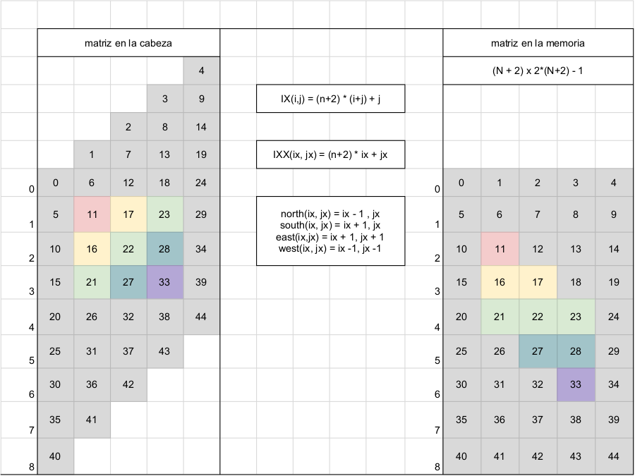
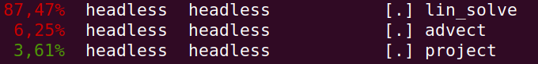
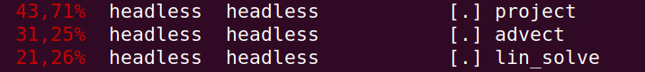
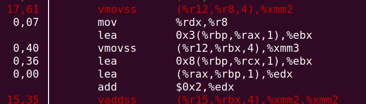
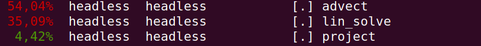
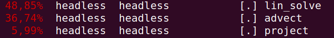
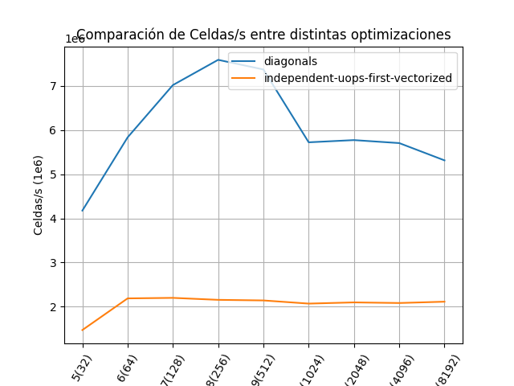

# Navier Stokes - Lab2

- Grupo:
    - Margionet Fabiola (Física)
    - Germán Ferrero (Computólogo)
---

# Agenda

Recorrido por diagonales y auto-vectorización

1. Disposición en Memoria.
2. Cómo se movió el choque con el Memory Wall.
3. Modificaciones necesarias para que autovectorice.
4. Resultados. 


---

# 1. Recorrido por diagonales y auto-vectorización

<figure>
    
    <figcaption>Fig 1: Disposición en Memoria</figcaption>
</figure>

---

# 2. La optimización en código

    !c
    static void lin_solve(const unsigned int n, boundary b, float* x, const float* x0, float a, float c)
    {
        for (unsigned int k = 0; k < 20; k++) {
            for (unsigned int ix = 2; ix <= n+1; ix++) {
                for (unsigned int jx = 1; jx < i; jx++) {
                    x[IXX(ix,jx)] = (x0[IXX(ix, jx)] + a * (
                        x[IXX(ix - 1, jx)] + 
                        x[IXX(ix + 1, jx)] +
                        x[IXX(ix - 1, jx - 1)] +
                        x[IXX(ix + 1, jx + 1)]
                    )) / c;
                }
            }
            for (unsigned int ix = n+2; ix <= 2 * n; ix++){
                for (unsigned int jx = ix - n; jx < n + 1; jx++){
                    x[IXX(ix,jx)] = (x0[IXX(ix, jx)] + a * (
                        x[IXX(ix - 1, jx)] + 
                        x[IXX(ix + 1, jx)] +
                        x[IXX(ix - 1, jx - 1)] +
                        x[IXX(ix + 1, jx + 1)]
                    )) / c;
                }
            }
            set_bnd(n, b, x);
        }
    }
---

# 2. Cómo se movió el choque con el Memory Wall.

- Antes de optimizar

<figure>
    
    <figcaption>Fig 2: Perf Report antes de optimizar</figcaption>
</figure>


---

# 4. Cómo se movió el choque con el Memory Wall.
- Luego de optimizar `lin_solve`:

<figure>
    
    <figcaption>Fig 3: Perf Report luego de optimizar lin_solve</figcaption>
</figure>

---

# 4. Cómo se movió el choque con el Memory Wall.
- Luego de optimizar `lin_solve`, memory wall en project:

<figure>
    
    <figcaption>Fig 4: vmovss denota la latencia de memoria en project</figcaption>
</figure>

---


# 4. Cómo se movió el choque con el Memory Wall.
- Luego de optimizar `project`, memory wall en advect:

<figure>
    
    <figcaption>Fig 5: Perf report luego de optimizar project </figcaption>
</figure>

---

# 4. Cómo se movió el choque con el Memory Wall.
- Luego de optimizar `advect`, volvemos al orden original:

<figure>
    
    <figcaption>Fig 6: Perf report luego de optimizar las tres funciones </figcaption>
</figure>

---

# 4. Modificaciones necesarias para que autovectorice.
- Usando clang-12 con `-01 -ftree-vectorize`
- La más notoria:

    ```
    for (j = 1; j++; j <= n) { ... }
    ```
    
    ```
    remark: loop not vectorized: could not determine number of loop iterations
    ```

    Cambiando por:

    ```
    for (j = 1; j++; j < n+1) { ... }
    ```
   
    Autovectorizaba

- En advect el modelo de costo del compilador decía que no era beneficioso vectorizar.
    - Usamos `#pragma clang loop vectorize(enable)`

---

# 5. Resultados

<figure>
    
    <figcaption>Fig 7: Resultados </figcaption>
</figure>

---

# Eso es todo
