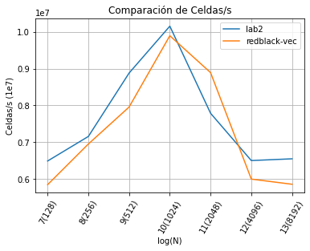
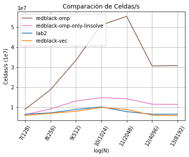
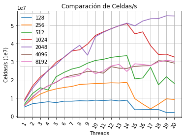
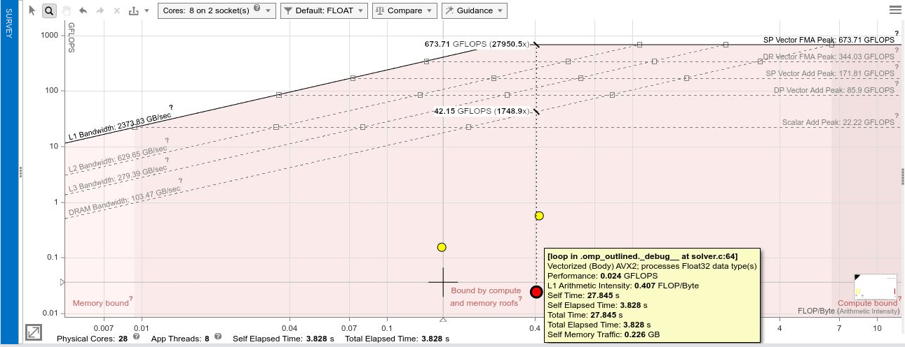

# Navier Stokes - Lab3

- Germán Ferrero (Computólogo)

---

# Agenda

1. Cambio a versión red-black, vectorizacion.
2. OMP sobre red-black.
3. Resultados.

---

# 1. Cambio a versión red-black, vectorizacion.

<figure>
    
    <figcaption>Fig 1: Versión Anterior</figcaption>
</figure>

---

# 1. Cambios a Red Black para poder vectorizar todo.

Cambiar ix() por una Macro

    !c
     #define IXX(y, x, stride) ((x) + (y) * (stride))
    
Usar IXX también en project y en advect
    
    !c
     // Nuevas funciones
     project_before_rb_step(...){
         (...)
         // Restar el de la izquierda y sumar el de la derecha con el shift
         v[index] -= 0.5f * n * ((p_shift * p[index + p_shift]) + (-p_shift * p [index]));
         (...)
     }
 
     project_after_rb_step(...)
 
     advect_rb_step(...){
         (...)
         // Calculo de i y j original
         int i = yit;
         int j = 1 - start  + 2 * xit;
         int index = IXX(yit, xit, width);
         (...)
     }

---

# 1. Cambios a Red Black para poder vectorizar.
<figure>
    
    <figcaption>Fig 2: Comparación soluciones vectoriales</figcaption>
</figure>

---

# 2. OMP sobre red-black, solo lin_solve

    !c
     #pragma omp parallel for default(none) shared(same, same0, neigh) \
     firstprivate(n, shift, start, width, a, c)
     for (unsigned int y = 1; y <= n; ++y) {
         const int p_shift = y % 2 == 0 ? -shift: shift;
         const int p_start = y % 2 == 0 ? 1 - start: start;
         (...)

---

# 2. OMP sobre red-black, tmb project y advect

    !c
    static void advect_rb_step(...){
        (...)
        #pragma omp parallel for default(none) shared(u, v, d0, d) firstprivate(n, start, width, dt0) private(i0, i1, j0, j1, x, y, s0, t0, s1, t1)
        for (unsigned int yit = 1; yit <= n; ++yit) {
            (...)
        }
    }

---

# 2. OMP sobre red-black, tmb project y advect

    !c
    static void project_after_rb_step(...){
        (...)
        #pragma omp parallel for default(none) shared(u, v, p) firstprivate(n, shift, start, width)
        for (unsigned int y = 1; y <= n; ++y) {
            (...)
        }
    }

---

# 3. Resultados, mejor performance por c/N

<figure>
    
    <figcaption>Fig 3: Mejor performance por cada N </figcaption>
</figure>

---

# 3. Resultados, scaling only linsolve.

<figure>
    
    <figcaption>Fig 4: Scaling para n threads solo linsolve </figcaption>
</figure>

---

# 3. Resultados, scaling final.

<figure>
    
    <figcaption>Fig 5: Scaling para n threads + project y advect </figcaption>
</figure>

---

# 3. Resultados, speedup y eficiencia

- N = 2048
    - Threads = 8: Speedup 4.4, Eficiencia 55%
    - Threads = 14: Speedup 5.7, Eficiencia 40%
    - Threads = 20: Speedup 6.2, Eficiencia 31%

- N = 8192
    - Threads = 8: Speedup 3.8, Eficiencia 48%
    - Threads = 14: Speedup 4.9, Eficiencia 35%
    - Threads = 20: Speedup 5.1, Eficiencia 26%
---

# 4. Roofline

Algo anda muy mal

<figure>
    
    <figcaption>Fig 5: Roofline, algo anda muy mal </figcaption>
</figure>

---

# Eso es todo
