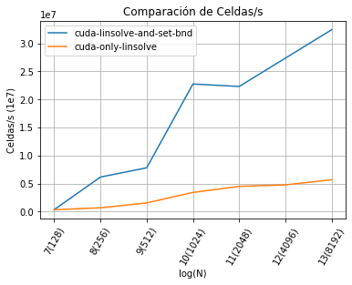
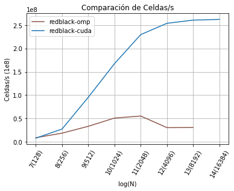
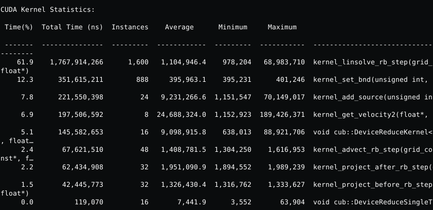
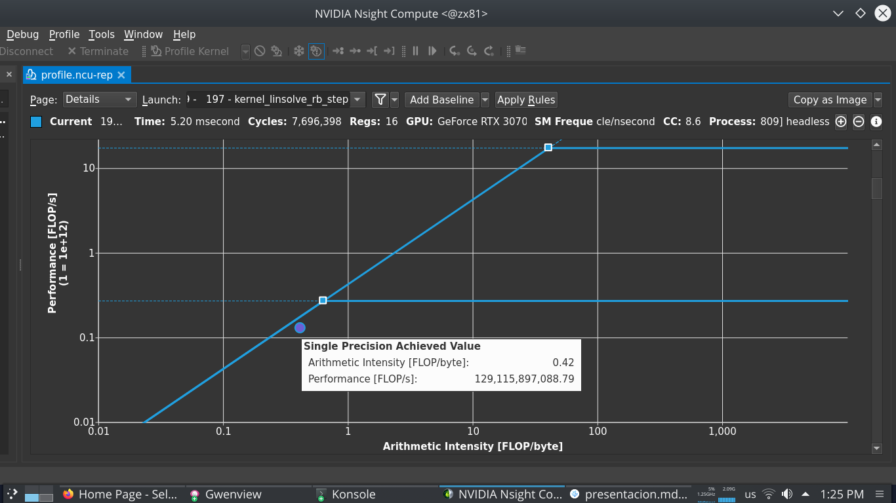
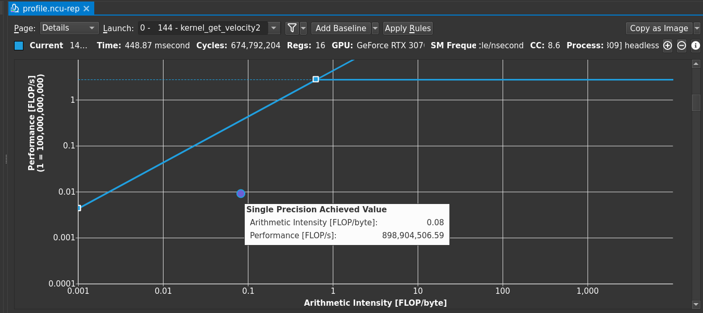

# Navier Stokes - Lab4

- Germán Ferrero (Computólogo)

---

# Agenda

1. Estrategia.
2. Kernels.
3. Resultados.

---

# 1. Estrategia

- Compilación
    - Primero intenté mantener archivos .c y .cu al mismo tiempo y compilarlos con clang / nvcc linkearlos con nvcc. Se me complicó.
    - Luego lo pasé todo a .cu y salió derecho.
- Migré a la GPU desde la función más pesada en cómputo total a la más liviana, hasta migrar todo el cómputo a la GPU.

---

# 2. Kernels: Linsolve

    !c
    __global__ void kernel_linsolve_rb_step(grid_color color,
                                        unsigned int n,
                                        float a,
                                        float c,
                                        const float * same0,
                                        const float * neigh,
                                        float * same)
    {
        unsigned int width = (n + 2) / 2;
        int x = blockIdx.x * blockDim.x + threadIdx.x;
        int y = blockIdx.y * blockDim.y + threadIdx.y;
        int index = IXX(y, x, width);
        
        int start_first_row = color == RED ? 0 : 1;
        int start = y % 2 == 1 ? start_first_row : 1 - start_first_row;
        if (x < start) {
            return;
        }
        if (x >= width + start - 1) {
            return;
        }
        if (y == 0 || y >= n+1) {
            return;
        }
        
        int shift_first_row = color == RED ? 1 : -1;
        int shift = y % 2 == 1 ? shift_first_row: -shift_first_row;
        same[index] = (same0[index] + a * (
            neigh[index - width] +
            neigh[index] +
            neigh[index + shift] +
            neigh[index + width]
        )) / c;
    }

---

# 2. Kernels: set_bnd (funcionó)

    !c
    __global__ void kernel_set_bnd(unsigned int n, boundary b, float* m)
    {
        int x = blockIdx.x * blockDim.x + threadIdx.x;
        int y = blockIdx.y * blockDim.y + threadIdx.y;

        if (x > (n + 1) || y > (n + 1)){
            return;
        }
        int index = IX(x, y);
        if (x == 0){
            if (y == 0){
                m[index] = 0.5f * (m[IX(1, 0)] + m[IX(0, 1)]);
            }
            if (y == n+1){
                m[index] = 0.5f * (m[IX(1, n + 1)] + m[IX(0, n)]);
            }
            else {
                m[index] = b == VERTICAL ? -m[IX(1, y)] : m[IX(1, y)];
            }
        }
        (...)
    }

--- 

# 2. Kernels: set_bnd red black (buggy)

    !c
    __global__ void kernel_set_bnd(grid_color color, unsigned int n, boundary b, float* m, float* m_neigh)
    {
        unsigned int width = (n + 2) / 2;
        int x = blockIdx.x * blockDim.x + threadIdx.x;
        int y = blockIdx.y * blockDim.y + threadIdx.y;

        if (x > (width - 1) || y > n+1) {
            return;
        }

        int start_first_row = color == RED ? 0 : 1;
        int start = y % 2 == 1 ? start_first_row : 1 - start_first_row;

        if (color == RED && x == 0 && y == 0) {
            m[IXX(0, 0, width)] = 0.5f * (m_neigh[IXX(0, 0, width)] + m_neigh[IXX(1, 0, width)]);
            return;
        }
        if (color == RED && x == width && y == n + 1) { ... }
        if (color == BLACK && x == 0 && y == n + 1) { ... }
        if (color == BLACK && x == width && y == 0) { ... }
        if (x < start || x >= width + start - 1) { ... }
        if (y == 0) { ... }
        if (y == n+1) { ... } 
    }

---

# 2. Resultados parciales, Paginación

<figure>
    
    <figcaption>Fig 1: linsolve vs linsolve + set_bnd</figcaption>
</figure>

---

# 2. Kernels: velocities2 and react

    !c
    __global__ void kernel_get_velocity2(float * velocity2, unsigned int n, const float* u, const float* v) {
        unsigned int width = (n + 2) / 2;
        int x = blockIdx.x * blockDim.x + threadIdx.x;
        int y = blockIdx.y * blockDim.y + threadIdx.y;
        if (x > (n + 1) || y > (n + 1)){
            return;
        }
        int index = IXX(y, x, width);
        velocity2[index] = u[index] * u[index] + v[index] * v[index];
    }

    void react(...){
        (...)
        launcher_get_velocity2(velocity2, N, u, v);
        void *v2_temp_storage = NULL;
        size_t v2_temp_storage_bytes = 0;
        cub::DeviceReduce::Max(v2_temp_storage, v2_temp_storage_bytes, velocity2, max_velocity2, size);
        checkCudaCall(cudaMalloc(&v2_temp_storage, v2_temp_storage_bytes));
        cub::DeviceReduce::Max(v2_temp_storage, v2_temp_storage_bytes, velocity2, max_velocity2, size);
        (...)
    }

---

# 2. Kernels, BLOCK_SIZE

- Resultados para N = 8192,
    - BS = 32, Cps: 217 1e6
    - BS = 16, Cps: 260 1e6
    - BS = 8, Cps: 201 1e6

---

# 3. Resultados, omp vs cuda

<figure>
    
    <figcaption>Fig 2: omp vs cuda </figcaption>
</figure>

---

# 3. Resultados, kernels stats.
<figure>
    
    <figcaption>Fig 3: Estadísticas de kernels</figcaption>
</figure>

---

# 3. Resultados, roofline linsolve
<figure>
    
    <figcaption>Fig 4: Roofline Linsolve</figcaption>
</figure>

---

# 3. Resultados, roofline velocites2
<figure>
    
    <figcaption>Fig 4: Roofline velocities2</figcaption>
</figure>

---

# 4. En el tintero

- Usar múltiples CUDA streams para paralelizar kernels cuando sea posible.
- Explorar las ayudas de ncu-ui en detalle. :(

---

# Eso es todo
